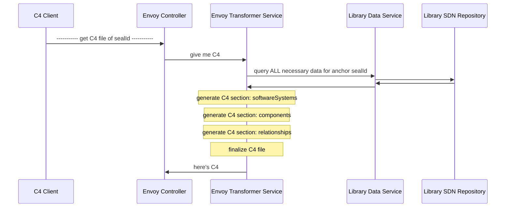
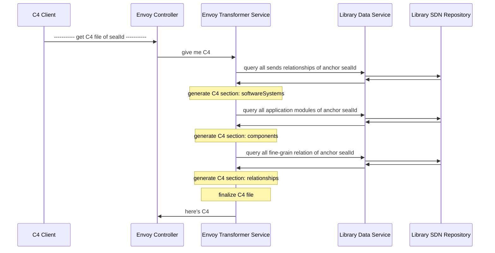

```mermaid
sequenceDiagram
    participant C4 Client
    participant Envoy Controller
    participant Envoy Transformer Service
    participant Library Data Service
    participant Library SDN Repository
    
    C4 Client ->> Envoy Controller: ----------- get C4 file of sealId -----------
    Envoy Controller ->> Envoy Transformer Service: give me C4

    Envoy Transformer Service ->> Library Data Service: query ALL necessary data for anchor sealId
    Library Data Service ->> Library SDN Repository: 
    Library SDN Repository ->> Library Data Service: 
    Library Data Service ->> Envoy Transformer Service: 

    Note over Envoy Transformer Service: generate C4 section: softwareSystems
    Note over Envoy Transformer Service: generate C4 section: components
    Note over Envoy Transformer Service: generate C4 section: relationships
    Note over Envoy Transformer Service: finalize C4 file
    
    Envoy Transformer Service ->> Envoy Controller: here's C4
```

```mermaid
sequenceDiagram
    participant C4 Client
    participant Envoy Controller
    participant Envoy Transformer Service
    participant Library Data Service
    participant Library SDN Repository
    
    C4 Client ->> Envoy Controller: ----------- get C4 file of sealId -----------
    Envoy Controller ->> Envoy Transformer Service: give me C4

    Envoy Transformer Service ->> Library Data Service: query all sends relationships of anchor sealId
    Library Data Service ->> Library SDN Repository: 
    Library SDN Repository ->> Library Data Service: 
    Library Data Service ->> Envoy Transformer Service: 
    Note over Envoy Transformer Service: generate C4 section: softwareSystems

    Envoy Transformer Service ->> Library Data Service: query all application modules of anchor sealId
    Library Data Service ->> Library SDN Repository: 
    Library SDN Repository ->> Library Data Service: 
    Library Data Service ->> Envoy Transformer Service: 
    Note over Envoy Transformer Service: generate C4 section: components

    Envoy Transformer Service ->> Library Data Service: query all fine-grain relation of anchor sealId
    Library Data Service ->> Library SDN Repository: 
    Library SDN Repository ->> Library Data Service: 
    Library Data Service ->> Envoy Transformer Service: 
    Note over Envoy Transformer Service: generate C4 section: relationships

    Note over Envoy Transformer Service: finalize C4 file
    
    Envoy Transformer Service ->> Envoy Controller: here's C4
```